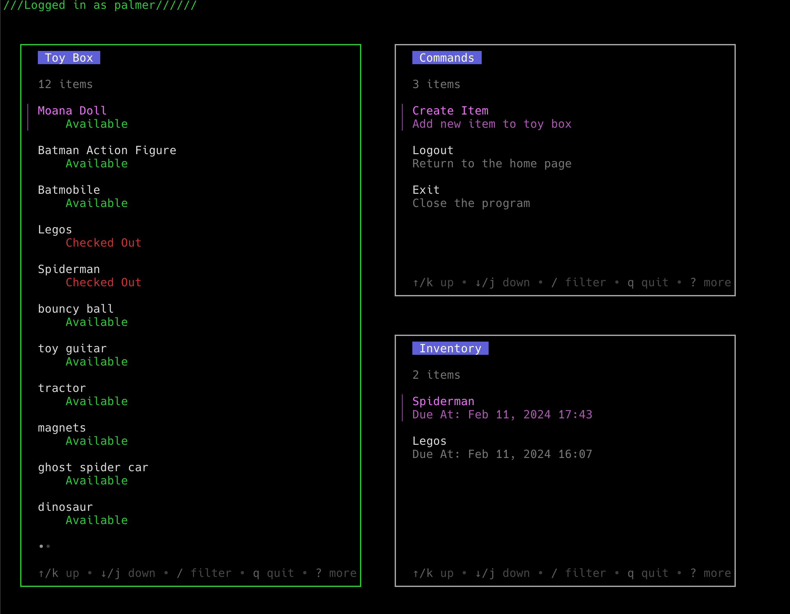
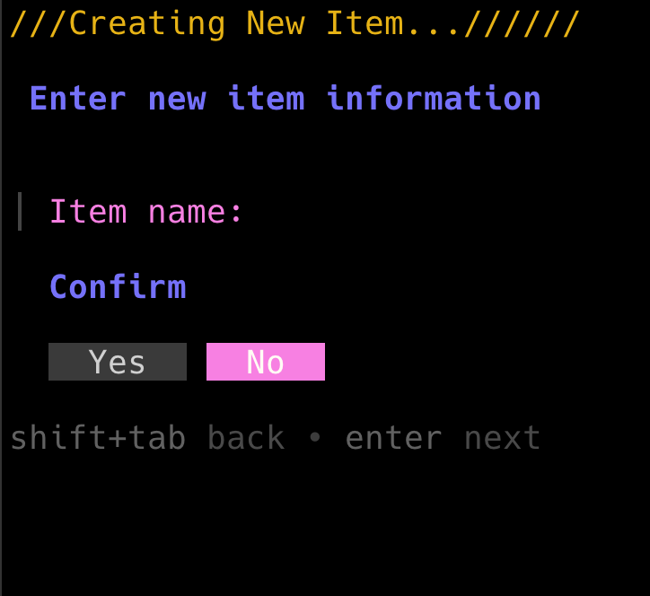
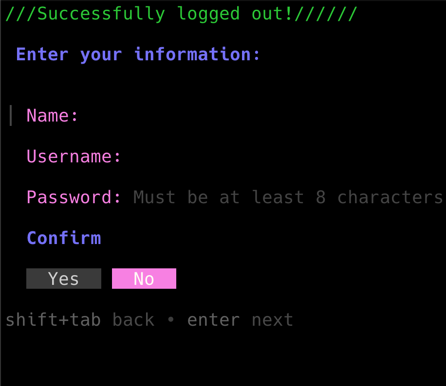
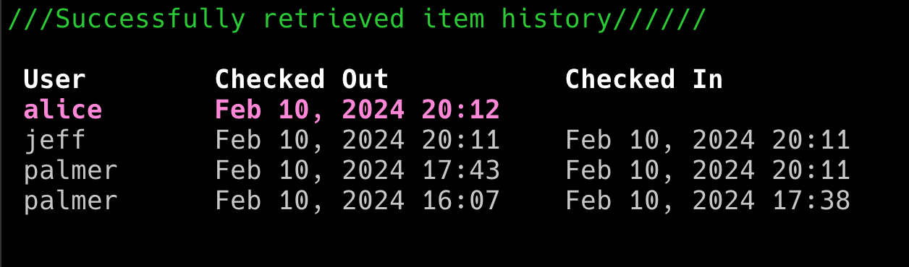

# Toy Box

This is a TUI app, built with the [bubbletea](https://github.com/charmbracelet/bubbletea/tree/master) framework in Go. The backend is an HTTP REST API built in Go, also using a PostgreSQL database. Documentation for the app can be found [here](docs/bubbletea%20app/README.md). And documentation for the REST API can be found [here](docs/REST%20API/README.md).

Tech Stack:

* [Bubbletea](https://github.com/charmbracelet/bubbletea/tree/master) TUI library
* [Chi](https://github.com/go-chi/chi) HTTP library
* [SQLC](https://sqlc.dev/) SQL code generation tool
* [postgreSQL](https://www.postgresql.org/) database

I created this app as a model for sharing toys for my toddlers who are trying to learn the concept.

This is a sample app, but could easily be translated into other domains such as:

* A library book checkout system
* Tracking employee's use of company resources
* Keeping track of repeated tasks, chores, daily cleaning checklist, etc.
* And more!

The main page of the app is a view of three lists: a list of all the items and their check out status, a list of the actions you can perform, and a list of the current user's checked out items:

The app also contains other pages for filling out forms, view an item's check out history, etc.

